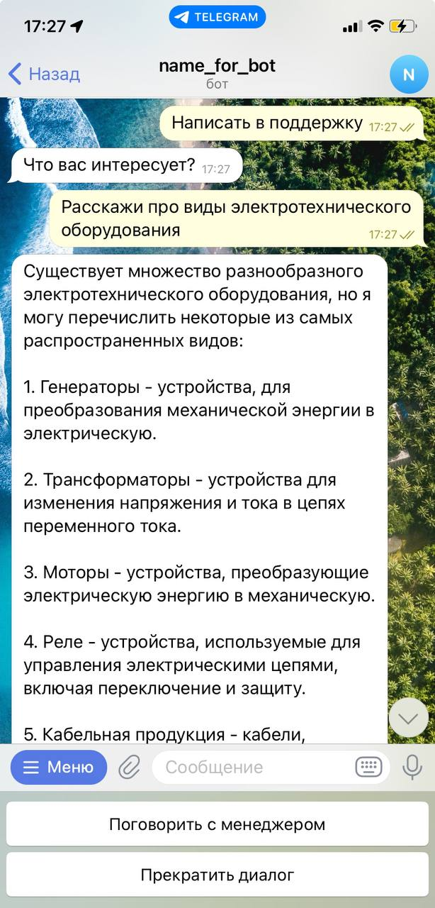

# ЭнергоПро бот

Бот для общения со службой поддержки компании Энерго Про.

## Возможности:

##### Закзать оборудование
Бот открывает веб-форму для заполнения информации и отправления заявки менеджеру (веб-форма расположена отдельно).

##### Написать в поддержку
Бот открывает окно для связи с ChatGPT. Чат-бот настроен так, что отвечает на консультационные вопросы касаемо
энерготехнического оборудования. Если пользователь задает отвлеченный вопрос, то бот вежливо объясняет, 
что не может на него ответить. Также можно начать диалог с менеджером.

При общении с менеджером сообщения отправляются в отдельный канал, где менеджер может отвечать на вопросы.

##### Заказать обратный звонок
Бот может отправить заявку на звонрок в чат менеджеров.

##### Получить презентацию
Бот отправляет заранее подготовленную презентацию в чат.

##### О нас
Бот рассказывает о компании и дает контакты для связи.
